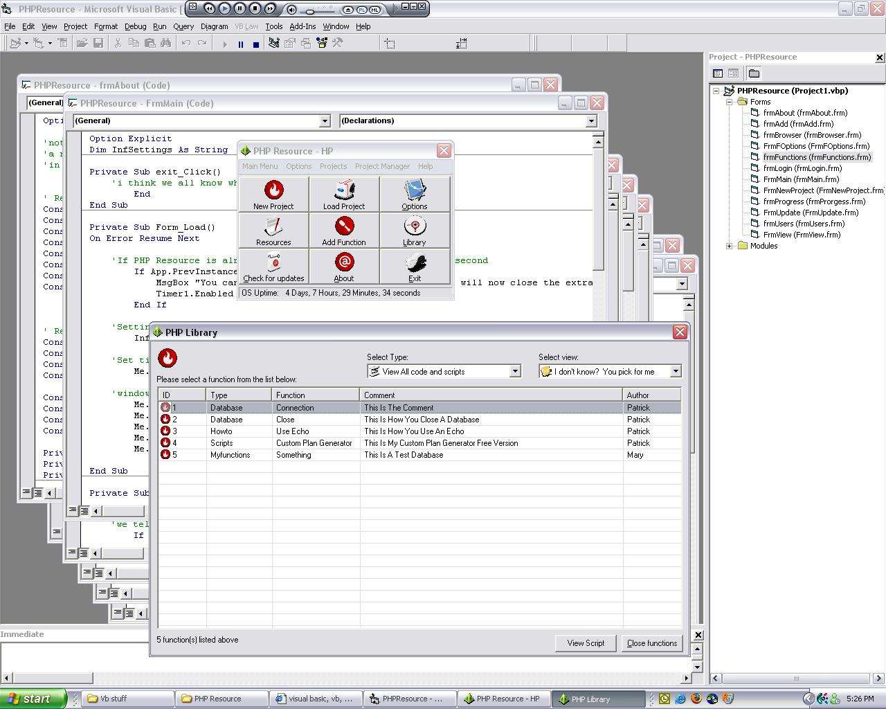



## PHP Resource

### Description

This is a program i originally started about 3 months ago and have been side tracked and lost interest for awhile to continue.

If i believe this could become a useful program and learning tool i'll gladly continue it.

The purpose of the program is to carry a database of 1000's of php sniplets (as i am a php programmer) to assist yourself for future use.

Also the idea was to simplify PHP for new programmers looking for a specific function, sniplet etc.

Let me know
 
### More Info
 

             |
---                |---
**Submitted On**   |2006-09-28 17:22:58
**By**             |[Patrick G](https://github.com/Planet-Source-Code/PSCIndex/blob/master/ByAuthor/patrick-g.md)
**Level**          |Advanced
**User Rating**    |5.0 (10 globes from 2 users)
**Compatibility**  |VB 6\.0
**Category**       |[Complete Applications](https://github.com/Planet-Source-Code/PSCIndex/blob/master/ByCategory/complete-applications__1-27.md)
**World**          |[Visual Basic](https://github.com/Planet-Source-Code/PSCIndex/blob/master/ByWorld/visual-basic.md)
**Archive File**   |[PHP\_Resour2022229282006\.zip](https://github.com/Planet-Source-Code/patrick-g-php-resource__1-66664/archive/master.zip)

